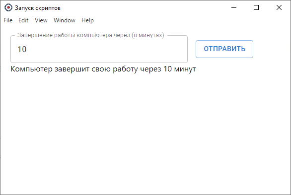

# electron-react

electron-react - проект (desktop приложение) для удобного запуска .bat файлов.
Структура проекта Electron Forge + Create React App.

Основной функционал приложения:

* отложенное выключение компьютера.



### Установка

```shell
npm install
cd client | npm install
```

### Запуск

```shell
npm run start-client
npm run start
```

### Сборка проекта под Windows

```shell
npm run make
```